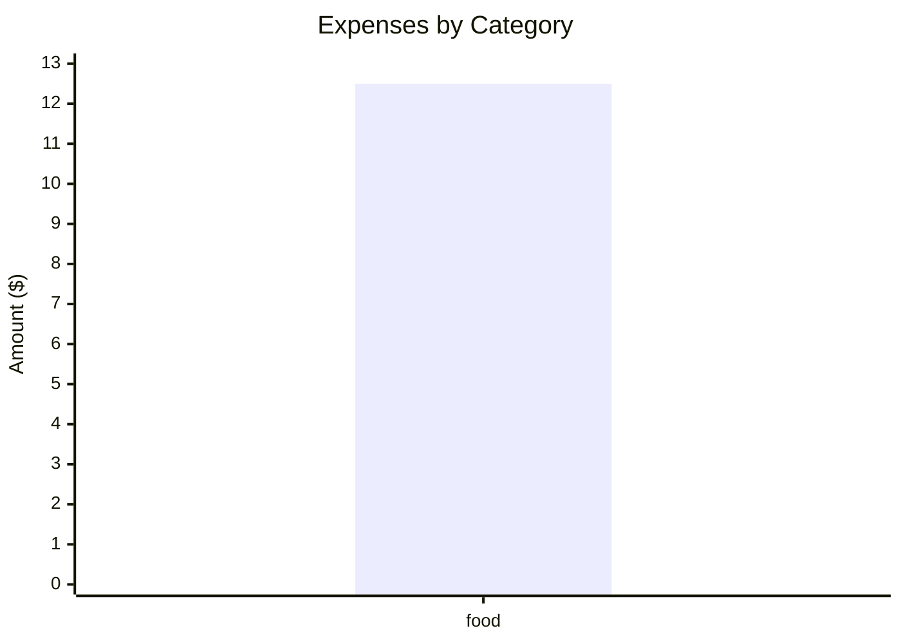

# Joplin Expense Plugin

A comprehensive expense tracking plugin for Joplin with structured folder organization and automatic summary generation.

## Features

### 🏗️ Structured Organization
- **Folder Structure**: `/expenses/2025/01`, `/expenses/2025/02`, etc. for monthly expense documents
- **Annual Summary**: `/expenses/2025` document for yearly summaries
- **New Expenses Hub**: `/expenses/new-expenses` for quick expense entry

### 📊 Auto-Summary Generation
- **Comment Markers**: Similar to inline-todo plugin using `<!-- expenses-summary -->` markers
- **Monthly Summaries**: Auto-generated summaries per category per month with visual charts
- **Annual Reports**: Comprehensive yearly expense analysis with category distribution
- **Category Breakdown**: Detailed analysis by expense categories
- **Visual Charts**: Mermaid bar charts showing expense distribution by category
- **Smart Positioning**: Summaries automatically positioned at document beginning with dark-theme-friendly styling

### 🎯 Smart Expense Management
- **Configurable Categories**: Customizable expense categories via settings
- **Quick Entry**: Add expenses with current timestamp
- **Auto-Processing**: Automatically move expenses to correct year/month documents with selective row removal
- **Auto-Date Filling**: Empty date fields are automatically filled when moving expenses
- **Table Editor**: Enhanced spreadsheet-like editor with category dropdowns
- **Smart Autocomplete**: Category suggestions in markdown and rich text editors
- **Auto-Sorting**: Expenses automatically sorted by date in descending order (newest first)

## Usage

### Quick Start
1. **Initialize Structure**: Use "Initialize Expense Folder Structure" to set up folders
2. **Add Expense**: Use "Add New Expense" to quickly add an expense
3. **Process Expenses**: Use "Process New Expenses" to move them to monthly documents
4. **Generate Summaries**: Use "Generate Expense Summaries" to update all auto-summaries

### Commands Available

#### Main Commands
- **Add New Expense**: Quick dialog to add an expense with current date/time
- **Edit Current Month Expenses**: Opens table editor for current month's expense document
- **Edit Expense Table**: Table editor for the currently selected note
- **Process New Expenses**: Moves expenses from new-expenses to monthly documents (removes only successfully moved rows)
- **Generate Expense Summaries**: Updates all summary comment markers with charts and styling
- **Open New-Expenses Document**: Opens the quick-entry document

#### Settings & Maintenance
- **Manage Expense Categories**: Configure your expense categories
- **Initialize Expense Folder Structure**: Set up the folder hierarchy

### Folder Structure

```
📁 expenses/
├── 📄 new-expenses (Quick entry document)
├── 📁 2025/
│   ├── 📄 2025 (Annual summary)
│   ├── 📄 01 (January expenses)
│   ├── 📄 02 (February expenses)
│   └── ... (Other months)
└── 📁 2024/
    └── ... (Previous years)
```

### Comment Markers

The plugin automatically processes these comment markers to generate summaries:

#### Monthly Summary
```markdown
<!-- expenses-summary-monthly month="2025-01" -->
<!-- /expenses-summary-monthly -->
```

#### Annual Summary
```markdown
<!-- expenses-summary-annual year="2025" -->
<!-- /expenses-summary-annual -->
```

#### Category Breakdown
```markdown
<!-- expenses-breakdown category="food" month="2025-01" -->
<!-- /expenses-breakdown -->
```

### Expense Table Format

```markdown
| price | description | category | date | shop | attachment | recurring |
|-------|-------------|----------|------|------|------------|-----------|
| 12.50 | Coffee      | food     | 2025-01-15T10:30:00 | Cafe | | |
| -500  | Salary      | income   | 2025-01-01T09:00:00 | Company | | monthly |
```

## Settings

Configure the plugin through **Tools > Options > Expenses Plugin**:

- **Expense Categories**: Comma-separated list of categories
- **Auto-Processing**: Automatically process summaries when notes are saved
- **Expenses Folder Path**: Main folder name (default: "expenses")
- **Default Currency Symbol**: Currency symbol for summaries (default: "$")

## Migration from Old System

If you were using the plugin before this refactor:

1. **Backup**: Export your existing expense notes
2. **Initialize**: Run "Initialize Expense Folder Structure"
3. **Copy Data**: Use "Edit Expense Table" on old notes, then copy entries to appropriate monthly documents
4. **Process**: Use "Generate Expense Summaries" to create auto-summaries

## Default Categories

- food
- transport
- utilities
- entertainment
- shopping
- income
- other

## Development

### Building
```bash
npm run dist
```

### File Structure
```
src/
├── index.ts                    # Main plugin entry
├── types.ts                    # Type definitions
├── expenseParser.ts            # Enhanced expense parsing
├── contentScripts/
│   └── expenseAutocomplete.ts  # Category autocomplete for editors
├── services/
│   ├── SettingsService.ts      # Plugin settings management
│   ├── FolderService.ts        # Folder structure management
│   ├── ExpenseService.ts       # Expense operations
│   ├── SummaryService.ts       # Auto-summary generation
│   └── TableEditorService.ts   # Built-in table editor
└── utils/
    └── dateUtils.ts            # Date utility functions
```

## Examples

### Adding a Quick Expense
1. Run "Add New Expense" command
2. Fill in amount, description, category, shop
3. Expense is added to new-expenses document with current timestamp
4. Run "Process New Expenses" to move to monthly document (automatically fills empty dates)
5. Only successfully moved expenses are removed from new-expenses document

### Using Category Autocomplete
1. When editing expense tables in markdown or rich text editor
2. Navigate to the category column (3rd column) of an expense table
3. Start typing a category name
4. Autocomplete suggestions will appear based on your configured categories
5. Press Tab or Enter to accept a suggestion

### Auto-Sorted Tables
- All expense tables are automatically sorted by date in descending order (newest first)
- This happens whenever expenses are processed or tables are updated
- Ensures consistent chronological organization across all documents

### Auto-Summary in Monthly Document
```markdown
# January 2025 Expenses

<div style="color: #ff7979">

**January 2025 Summary**

- **Total Expenses:** $12.50
- **Total Income:** $0.00
- **Net Amount:** $-12.50
- **Entry Count:** 1

**By Category:**
- food: $12.50

**Expense Distribution:**



</div>

## Expense Table
| price | description | category | date | shop | attachment | recurring |
|-------|-------------|----------|------|------|------------|-----------|
| 12.50 | Coffee      | food     | 2025-01-15T10:30:00 | Cafe | | |
```

## Changelog

### v2.0.0 (Refactored - No Legacy Support)
- ✨ **NEW**: Structured folder organization
- ✨ **NEW**: Auto-summary generation with comment markers and visual charts
- ✨ **NEW**: Quick expense entry with current timestamp and auto-date filling
- ✨ **NEW**: Configurable categories
- ✨ **NEW**: Smart auto-processing with selective row removal from new-expenses
- ✨ **NEW**: Built-in table editor with dropdowns and validation
- ✨ **NEW**: Mermaid bar charts in summaries showing expense distribution
- ✨ **NEW**: Dark-theme-friendly red styling for summaries
- ✨ **NEW**: Smart summary positioning at document beginning
- ✨ **NEW**: Category autocomplete in markdown and rich text editors
- ✨ **NEW**: Automatic date-based sorting (newest first) for all expense tables
- 🔄 **IMPROVED**: Settings management with proper Joplin integration
- 🔄 **IMPROVED**: Better error handling and validation
- 🔄 **REMOVED**: Legacy table editor and summary panel
- 📚 **CLEAN**: Streamlined codebase without backward compatibility

### v1.0.0 (Original)
- Basic expense table editing
- Simple summary generation

This is your new Joplin plugin. It is suggested that you use this README file to document your plugin.

For information on how to build or publish the plugin, please see [GENERATOR_DOC.md](./GENERATOR_DOC.md)
