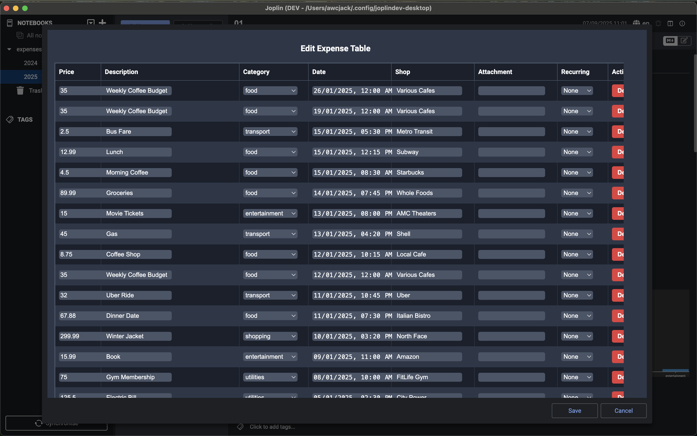
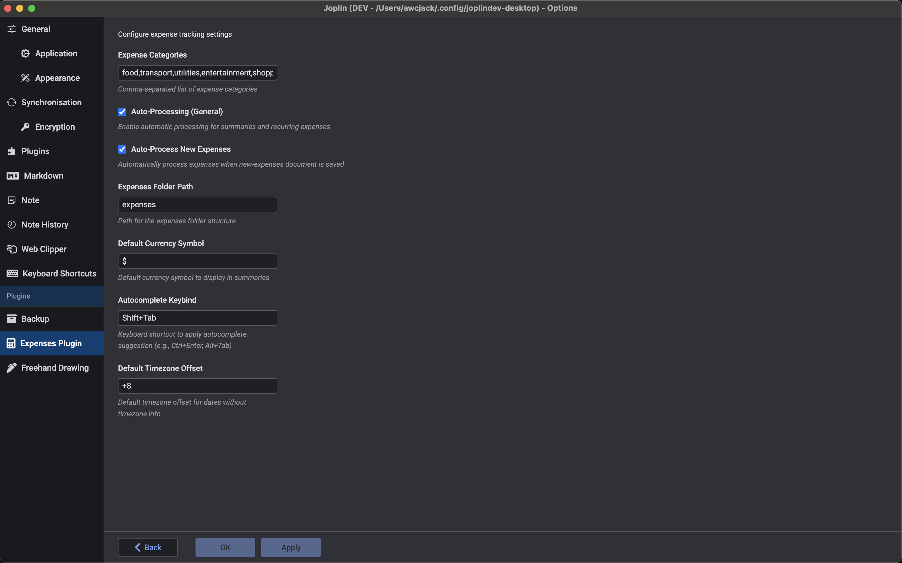
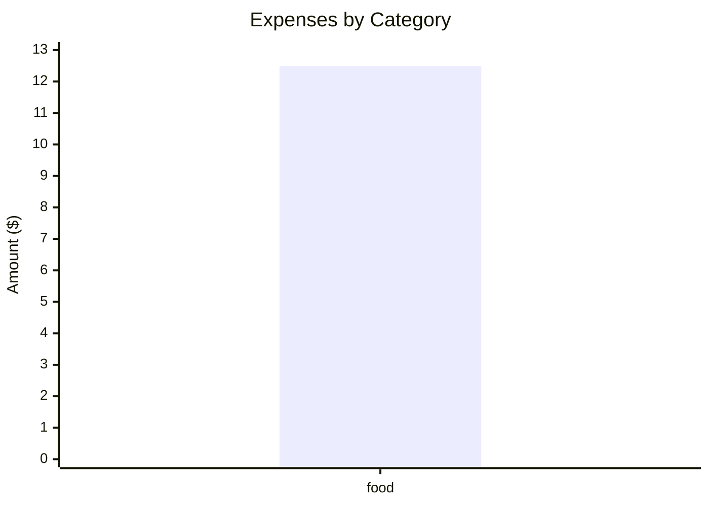

**The code is mainly created via copilot and claude code and some of the feature haven't been tested**

# Joplin Expense Plugin

A comprehensive expense tracking plugin for Joplin with structured folder organization and automatic summary generation.

## Features

### 🏗️ Structured Organization
- **Folder Structure**: `/expenses/2025/01`, `/expenses/2025/02`, etc. for monthly expense documents
- **Annual Summary**: `/expenses/2025` document for yearly summaries
- **New Expenses Hub**: `/expenses/new-expenses` for quick expense entry

### 📊 Auto-Summary Generation
- **Comment Markers**: Using `<!-- expenses-summary -->` markers
- **Monthly Summaries**: Auto-generated summaries per category per month with visual charts
- **Annual Reports**: Comprehensive yearly expense analysis with category distribution
- **Category Breakdown**: Detailed analysis by expense categories
- **Visual Charts**: Mermaid bar charts showing expense distribution by category

### 🎯 Smart Expense Management
- **Configurable Categories**: Customizable expense categories via settings
- **Quick Entry**: Add expenses with current timestamp
- **Auto-Processing**: Automatically move expenses to correct year/month documents
- **Table Editor**: Enhanced spreadsheet-like editor with category dropdowns
- **Smart Autocomplete**: Category suggestions in markdown and rich text editors
- **Auto-Sorting**: Expenses automatically sorted by date in descending order (newest first)

## Screenshots

### Plugin Interface & Folder Structure


*Auto-generated expense summary with visual charts, category breakdown, and organized folder structure in the sidebar*


*Clean expense table interface showing categorized transactions with the monthly folder structure visible in the sidebar*


*Plugin settings panel showing customizable categories, folder configuration, and other preferences*

### Key Features Demonstrated

**✨ Auto-Generated Summaries**
- Colorful summary sections with total expenses, income, and net amount
- Category-wise breakdown with detailed amounts
- Interactive Mermaid charts showing expense distribution
- Professional styling with red accent color scheme

**📁 Organized Structure** 
- Hierarchical folder structure: `expenses/2025/01`, `02`, etc.
- Monthly documents (01-12) under each year folder
- Clean sidebar navigation showing expense organization

**📊 Smart Table Management**
- Well-formatted expense tables with proper columns
- Auto-sorted by date (newest first)
- Category-based organization (food, transport, entertainment, shopping)
- Real transaction data with shops, dates, and amounts

**🎯 Professional Interface**
- Clean, modern interface integrated seamlessly with Joplin
- Dark theme compatibility
- Intuitive layout with clear visual hierarchy

## Usage

### Quick Start
1. **Initialize Structure**: Use "Initialize Expense Folder Structure" to set up folders (Should init automatically once restart)
2. **Add Expense**: Use "Add New Expense" to quickly add an expense
3. **Process Expenses**: Use "Process New Expenses" to move them to monthly documents
4. **Generate Summaries**: Use "Generate Expense Summaries" to update all auto-summaries

### Commands Available

#### Main Commands
- **Add New Expense**: Quick dialog to add an expense with current date/time
- **Edit Current Month Expenses**: Opens table editor for current month's expense document
- **Edit Expense Table**: Table editor for the currently selected note
- **Process New Expenses**: Moves expenses from new-expenses to monthly documents (removes only successfully moved rows)
- **Generate Expense Summaries**: Updates all summary comment markers with charts and styling
- **Open New-Expenses Document**: Opens the quick-entry document

#### Import/Export
- **Import MoneyWallet CSV**: Import expenses from MoneyWallet Android app CSV export

#### Settings & Maintenance
- **Manage Expense Categories**: Configure your expense categories
- **Initialize Expense Folder Structure**: Set up the folder hierarchy

### Folder Structure

```
📁 expenses/
├── 📄 new-expenses (Quick entry document)
├── 📁 2025/
│   ├── 📄 2025 (Annual summary)
│   ├── 📄 01 (January expenses)
│   ├── 📄 02 (February expenses)
│   └── ... (Other months)
└── 📁 2024/
    └── ... (Previous years)
```

### Comment Markers

The plugin automatically processes these comment markers to generate summaries:

#### Monthly Summary
```markdown
<!-- expenses-summary-monthly month="2025-01" -->
<!-- /expenses-summary-monthly -->
```

#### Annual Summary
```markdown
<!-- expenses-summary-annual year="2025" -->
<!-- /expenses-summary-annual -->
```

#### Category Breakdown
```markdown
<!-- expenses-breakdown category="food" month="2025-01" -->
<!-- /expenses-breakdown -->
```

### Expense Table Format

```markdown
| price | description | category |         date        |   shop  | attachment | recurring |
|-------|-------------|----------|---------------------|---------|------------|-----------|
| 12.50 | Coffee      | food     | 2025-01-15T10:30:00 | Cafe    |            |           |
| -500  | Salary      | income   | 2025-01-01T09:00:00 | Company |            | monthly   |
```

## Settings

Configure the plugin through **Tools > Options > Expenses Plugin**:

- **Expense Categories**: Comma-separated list of categories
- **Auto-Processing**: Automatically process summaries when notes are saved
- **Expenses Folder Path**: Main folder name (default: "expenses")
- **Default Currency Symbol**: Currency symbol for summaries (default: "$")

## Default Categories

- food
- transport
- utilities
- entertainment
- shopping
- income
- other

## Development

### Building
```bash
npm run dist
```

### File Structure
```
src/
├── index.ts                    # Main plugin entry
├── types.ts                    # Type definitions
├── expenseParser.ts            # Enhanced expense parsing
├── contentScripts/
│   └── expenseAutocomplete.ts  # Category autocomplete for editors
├── services/
│   ├── SettingsService.ts      # Plugin settings management
│   ├── FolderService.ts        # Folder structure management
│   ├── ExpenseService.ts       # Expense operations
│   ├── SummaryService.ts       # Auto-summary generation
│   └── TableEditorService.ts   # Built-in table editor
└── utils/
    └── dateUtils.ts            # Date utility functions
```

## Examples

### Adding a Quick Expense
1. Run "Add New Expense" command
2. Fill in amount, description, category, shop
3. Expense is added to new-expenses document with current timestamp
4. Run "Process New Expenses" to move to monthly document (automatically fills empty dates)
5. Only successfully moved expenses are removed from new-expenses document

### Using Category Autocomplete
1. When editing expense tables in markdown or rich text editor
2. Navigate to the category column (3rd column) of an expense table
3. Start typing a category name
4. Autocomplete suggestions will appear based on your configured categories
5. Press Ctrl + Enter or customized keybind to accept a suggestion

### Auto-Sorted Tables
- All expense tables are automatically sorted by date in descending order (newest first)
- This happens whenever expenses are processed or tables are updated
- Ensures consistent chronological organization across all documents

### Auto-Summary in Monthly Document
# January 2025 Expenses

<div style="color: #ff7979">

**January 2025 Summary**

- **Total Expenses:** $12.50
- **Total Income:** $0.00
- **Net Amount:** $-12.50
- **Entry Count:** 1

**By Category:**
- food: $12.50

**Expense Distribution:**


</div>

## Expense Table
| price | description | category |         date        | shop | attachment | recurring |
|-------|-------------|----------|---------------------|------|------------|-----------|
| 12.50 | Coffee      | food     | 2025-01-15T10:30:00 | Cafe |            |           |

## CSV Import (MoneyWallet)

The plugin supports importing expense data from MoneyWallet Android app CSV exports.

### How to Import

1. **Export from MoneyWallet**: Use MoneyWallet's export feature to create a CSV file
2. **Import in Joplin**: Use "Import MoneyWallet CSV" command from Tools menu
3. **Select Import Location**:
   - **New-Expenses Document** (recommended): Import to new-expenses for review before processing
   - **Direct to Monthly Documents**: Import directly to respective monthly documents

### Required CSV Format

MoneyWallet CSV must contain these required columns:
- **wallet**: Wallet/account name (maps to shop field)
- **currency**: ISO currency code (e.g., EUR, USD)
- **category**: Expense category
- **datetime**: Date and time in format YYYY-MM-DD HH:mm:ss
- **money**: Transaction amount (negative for expenses, positive for income)
- **description**: Transaction description

Optional columns:
- **place**: Place name (takes precedence over wallet for shop field)
- **event**: Event name (takes precedence over wallet for shop field)
- **people**: People involved (comma-separated)

### Field Mapping

MoneyWallet CSV → Joplin Expense:
- `wallet` → `shop` (or `event` → `shop` if event is provided)
- `category` → `category` (with smart mapping for common categories)
- `money` → `price`
- `description` → `description`  
- `datetime` → `date` (converted to ISO8601 format)
- `attachment` → `` (always empty)
- `recurring` → `` (always empty, set to false)

### Example CSV Format

```csv
wallet,currency,category,datetime,money,description,event,people
Bank account,EUR,food,2020-03-25 16:08:34,-45.89,Grocery shopping,Weekly shopping,John
Credit Card,EUR,transport,2020-03-26 09:15:22,-23.56,Bus ticket,,
Cash,EUR,entertainment,2020-03-27 20:30:00,-15.50,Movie theater,Date night,Alice
Bank account,EUR,income,2020-03-30 14:00:00,2500.00,Monthly salary,,
```

### Import Features

- **Validation**: Comprehensive CSV format validation before import
- **Preview**: Preview first few rows before importing 
- **Category Mapping**: Intelligent mapping of common category names
- **Error Handling**: Detailed error reporting for failed imports
- **Auto-categorization**: Automatically adds new categories to plugin settings
- **Flexible Import**: Choose between review-first or direct import modes
